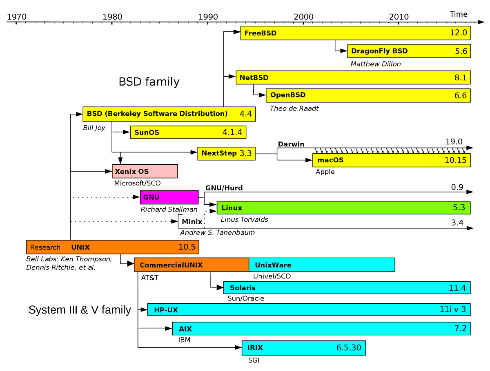

# Theory

## Linux

- Linux is considered a Unix-like operating system which basically means that Linux derives heavy inspiration from Unix
- **macOS** and **FreeBSD** would be two more examples of a Unix-like operating system
- Unix was created in the 70s at Bell Labs (from which descended AT&T) and has pretty much inspired every operating system created since then

### Unix Philosophy

The idea is instead of having a few very specialized tools (or programs) we should have many small, composable tools that we can use to compose to solve larger problems.

- Make each program do one thing well. To do a new job, build afresh rather than complicate old programs by adding new "features".
- Expect the output of every program to become the input to another.
  - Don't clutter output with extraneous information.
  - Don't insist on interactive input.
- Design and build software, even operating systems, to be tried early, ideally within weeks. Don't hesitate to throw away the clumsy parts and rebuild them.

### Linux Timeline and Distributions

