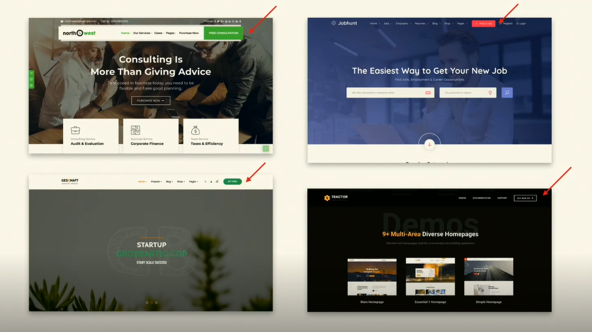

## Layouts

### Philosophy

1. Grid Layout generally looks very organised and sorted.
2. Symmetry is soothing to the brain.
   1. Asymmetry in a Symmetrical Layout is a good way to break the monotony and grab atention.
   2. Symmetry everywhere is boring.
      
3. Asymmetry can be hard to balance out things.
4. The [course slides](https://github.com/sdras/design-for-developers/tree/master/slides-pdf) contain some of the greatest examples
5. Imperfection in beauty looks amazing if done right.

> [dribbble](https://dribbble.com/) is an amazing site for inspiration.

### Shapes

1. Circles draw attention more than any other shape.
2. Same with moving things.

## PS:

There are so many good illustrations in the slides. I don't want to recreate those here. So, those slides are the best source of information for this section.

Book: [Making and Breaking the Grids](https://www.amazon.com/Making-Breaking-Grids-Designers-Design/)

## Tools

1. Photoshop
2. Illustrator
3. Sketch
